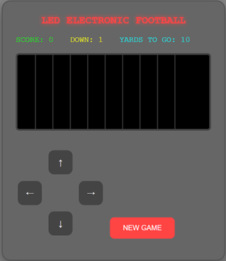

# LED Electronic Football Game

A modern web-based adaptation of the classic LED football game, built with HTML, CSS, and JavaScript.

## Game Overview

Relive the nostalgia of the classic handheld LED football game in your browser! Control the runner, dodge defenders, and score touchdowns in this retro-style football game.

## Getting Started

### Prerequisites
A modern web browser (Chrome, Firefox, Safari, Edge) that supports
- CSS Grid
- JavaScript ES6+
- requestAnimationFrame API

### Installation
1. Clone or download this repository
2. Open `index.html` in your web browser
3. Click "NEW GAME" to start playing

### Customization

Changes must be tested to they do not cause inconsistent behavior and 
visual artifacts. **Modify with caution!**

`script.js`
- The `MOVE_DELAY` constant controls the delay between defender moves
- Other constants can also be adjusted to change the game parameters

#### Other source files
- `styles.css` - Styling and animations
- `blinker.js` - Visual feedback effects

## How to Play

1. **Objective**: Score touchdowns by reaching the end zone while avoiding defenders.
2. **Controls**:
   - Use the arrow keys (↑, ↓, ←, →) to move your player
   - Press the "NEW GAME" button to start a new game
3. **Game Rules**:
   - You have 4 downs to traverse the field as often as you can
   - Each touchdown scores 7 points
   - The game ends when you're tackled 4 times

## Features

- Retro LED-style graphics
- Real-time player movement
- Score, down and distance indicators
- Defenders intelligent movement
- Smooth animations and visual feedback
- A grid-based playing field
- Tackle and touchdown effects

## License

This project is open source and licensed under the terms in this [LICENSE](LICENSE).
